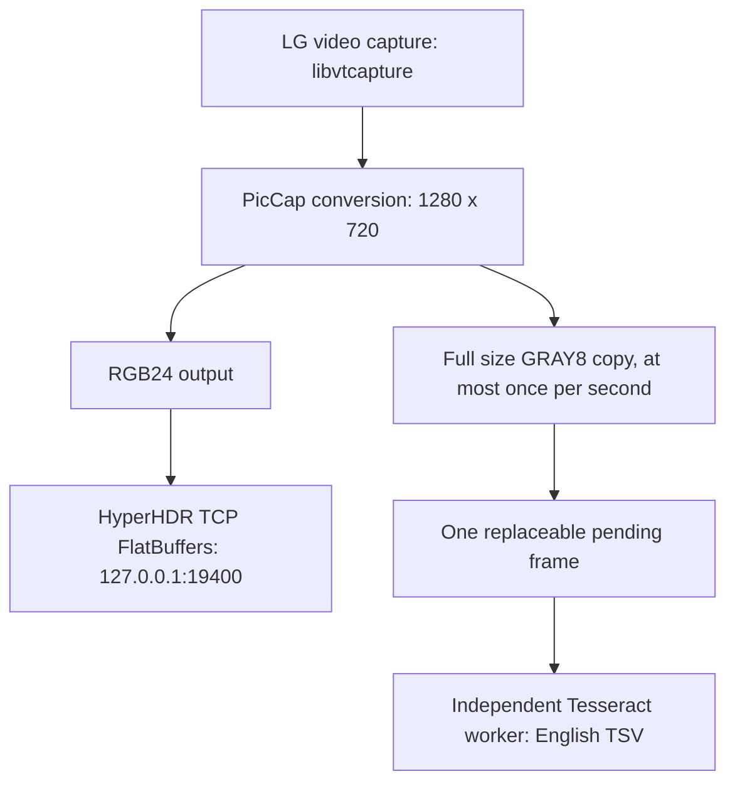

# G5: PicCap feeds HyperHDR and OCR from one capture

Measured 2026-10-04 on rooted LG OLED65G51LW, webOS 25. The modified PicCap 0.5.4
is installed and running. HyperHDR Forwarder is **disabled persistently**.

## Actual data flow

OCR taps the converted video frame before any TV UI blend. The current profile
has `nogui:true`, `nv12:false`, `ocr:true`, `autostart:true`, requested 60 FPS,
1280×720 and priority 150. There is one video capture backend and no TV UI
capture. HyperHDR's own VIDEO/SYSTEM grabbers are disabled. The second path is
inside PicCap, not a HyperHDR output/proxy or another TCP frame stream.

## What OCR actually receives

| Stage | Actual size | Format | Stride | Pixel bytes/frame |
|---|---|---|---:|---:|
| Video conversion / OCR tap | 1280×720 | ARGB32, BGRA byte order | 5120 | 3,686,400 |
| Tesseract input | 1280×720 | GRAY8 PGM | 1280 | 921,600 |
| HyperHDR output | 1280×720 | RGB24 | 3840 | 2,764,800 |

The LG backend internally captures NV12; `nv12:false` selects RGB output to
HyperHDR. Tesseract receives grayscale at the same dimensions, not a 320×240
lighting image. No resolution reduction occurs on either branch.

Saved paired samples from the deployed binary show an actual YouTube street
scene, visually inspected. Comparing every OCR pixel against
`(77*R + 150*G + 29*B) >> 8` of the saved HyperHDR input gives **zero differing
pixels out of 921,600**. This proves size/content/color conversion for that
sample. It is not an HDMI game OCR accuracy benchmark.

- [HyperHDR RGB input](evidence/ocr-dual-output/deployed/hyperhdr-input.png)
- [OCR grayscale input](evidence/ocr-dual-output/deployed/ocr-input.png)
- [Pixel comparison](evidence/ocr-dual-output/deployed/pixel-comparison.json)
- [Actual input metadata](evidence/ocr-dual-output/deployed/piccap-ocr-input.txt)
- [Sample TSV: words, boxes, confidence](evidence/ocr-dual-output/deployed/piccap-ocr-sample.tsv)

## Simultaneous operation measurement

24 status samples, 13:56:47–14:00:43 EEST, sample span 236.77 seconds:

| Measurement | Result |
|---|---:|
| PicCap reported capture FPS, arithmetic mean | 57.03 |
| PicCap reported capture FPS, sampled min–max | 54.14–58.96 |
| Completed OCRs during OCR completion window | 101 / 236.216 s |
| Actual completed OCR rate | 0.428 FPS |
| Sampled latest full-frame OCR processing time | 1226–4272 ms |
| PicCap running / video running / connected | true in all 24 samples |
| HyperHDR process | same PID 32464, running in all samples |

[Raw status samples](evidence/ocr-dual-output/forwarder-disabled-stability.jsonl),
[computed summary](evidence/ocr-dual-output/summary.json),
[final HyperHDR source/component state](evidence/ocr-dual-output/deployed/hyperhdr-state.json).

Capture FPS is PicCap's own telemetry, not independent counting of unique frames
received by HyperHDR. This run supports roughly 57 FPS with OCR active; it does
not establish sustained 60 unique FPS or quantify OCR's effect without a matched
OCR-off baseline. Processing latency is full OCR invocation time, not capture
latency. The latency range contains sampled latest results, not every invocation.

HyperHDR API reports active/visible FLATBUFSERVER priority 150 from loopback and
LEDDEVICE enabled. Physical LED colors were not visually verified in this run.
The final server also reports an unavailable optional Unix domain socket;
PicCap uses TCP and remains connected, so that error does not prevent this path.

## Why the previous output failed

Two sender defects were fixed: partial TCP writes previously discarded the
remaining packet, and reply reads assumed an entire header/payload in one read.
The sender now completes writes, reads complete validated replies, and reconnects
after a failed partial send. Invalid capture frames are not submitted.

These changes alone did not eliminate HyperHDR crashes. A temporary ARM preload
diagnostic captured SIGSEGV in libc memcpy with return address 0x5c288, inside
`FlatBuffersParser::encodeImageIntoFlatbuffers`, when the legacy NetworkForwarder
was enabled toward `127.0.0.1:32949`. After disabling this unused component, the
normal HyperHDR service survived the measured run above. The exact invalid buffer
cause inside HyperHDR has not been repaired or independently isolated.

Only `forwarder.enable` was changed in its application database; targets and all
other settings were retained. TV backup:
`/home/root/.hyperhdr/db/hyperhdr.before-ocr-dual.db`. Authentication was retained.
Debug preloading and debugger attachment are removed from the running service;
development log collection is restored off. No second capture was introduced.

## Worker behavior and limits

The capture thread makes a full grayscale copy at most once per second. A busy
mutex skips that sample. There is only one replaceable pending frame, so slow OCR
does not create an unbounded queue. Tesseract runs with one OpenMP thread and
niceness 10; the capture thread does not wait for recognition to finish.

Two grayscale buffers use about 1.76 MiB; sampled conversion reads about 3.52 MiB
and writes 0.88 MiB per submission. Worker copying and the temporary PGM add more
memory I/O; Tesseract's own working memory dominates beyond these buffers. CPU/
RSS overhead was not isolated in this run. Recognition launches a CLI process
per sampled frame and has no processing timeout yet; stopping OCR can wait for
the current Tesseract invocation.

The model is **English only**. Samples containing Cyrillic or background texture
produce noisy/incorrect words. TSV output confirms the OCR path runs, not that
game text recognition quality is sufficient. Next work should measure real
English game text and add text-region selection/tracking/cache before expecting
frequent updates. No translation or overlay is implemented.

## Reproducible artifacts and verification

Sources are preserved as [upstream patches](../patches/piccap-ocr/README.md),
with exact base commits and clean-base reconstruction checks.

Local IPK: `E:\Github\piccap\build\org.webosbrew.piccap_0.5.4_all.ipk`.
Local native binary: `E:\Github\piccap\hyperion-webos\build\ocr\hyperion-webos`.
Binary SHA256 used for the 236-second measurement above:
`4cb4bf4d0efd23a92a6436e4ed7344fdbc7c4914f17c2c6641d27c832eb08b3f`.

Later detector experiments and an on-demand OCR snapshot extension are recorded
in [the detector comparison](text-detector-comparison.md); these do not enable
GUI capture or introduce another video capture.

`file` reports ELF 32-bit LSB executable, ARM, EABI5, dynamically linked,
interpreter `/lib/ld-linux.so.3`, GNU/Linux 3.10.0, debug_info, not stripped.

Verified: native cross-build, host TCP regression test, package executable modes
0755, native root service launch, paired pixel equality, simultaneous runtime
measurement, clean-base patch application and reconstructed source equality.
The autostart boot hook now calls supported `status` instead of `isRunning`;
reboot persistence has not been tested by rebooting the TV.

Bounded TV diagnostics: `/tmp/piccap-hyperhdr-sample.ppm`,
`/tmp/piccap-ocr-sample.pgm`, `/tmp/piccap-ocr-sample.tsv`,
`/tmp/piccap-ocr-input.txt`, `/tmp/piccap-ocr-status.txt`,
`/tmp/piccap-ocr-latest.tsv`. No continuous video is saved.
